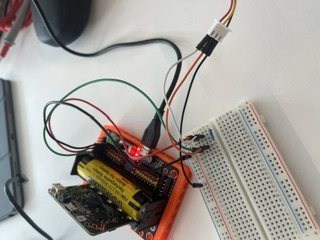

# GeekServos

Extension for Microsoft MakeCode Editor to simplify the use of GeekServos, especially 360° Servos.

## DS18B20

Die Datenleitung des Sensors braucht einen Pull-Up Widerstand. Dieser wird zwischen der Datenleitung und 3.3V verkabelt.
Es wird ein 4.7 kΩ Widerstand benötigt, auch ein 5 kΩ Widerstand funktioniert. (Wenn man zwei 10 kΩ Widerstände parallel schaltet, bekommt man auch einen 5 kΩ Widerstand. Also: Beide Widerstände jeweils mit ihren Enden an dieselben zwei Anschlusspunkte verbinden)

folgende Verkabelung:

- 3.3V von Micro:bit auf 3.3V von Sensor und 1. Widerstandsbein
- Datenleitung von Micro:bit auf Datenleitung von Sensor und 2. Widerstandsbein
- beide GND verbinden

Wenn man diesen Sensor über ModulePlus misst, dann muss man das Ergebnis durch 10 rechnen um zu den °C zu kommen.
